# Andreu Zapater Fillat
### Full Stack Developer

**Location:** Lleida, España | **Phone:** +34 601 417 690 | **Email:** andreu.zapater.fillat@gmail.com

---

## Professional Summary

Full Stack Developer with solid experience in modern web application development and a strong foundation in software engineering. Currently working at Grupo Rodi, developing scalable solutions for OK24, a leading roadside assistance platform. Specialized in building robust applications using React, Angular, Laravel, and Oracle databases, with expertise in both frontend and backend technologies.

Background in Electronic Engineering provides analytical problem-solving skills and systematic approach to software architecture. Committed to writing clean, maintainable code and implementing best practices in agile development environments.

---

## Professional Experience

### **Full Stack Developer** | Grupo Rodi (OK24)
*May 2024 - Present | Lleida, Spain*

- Develop and maintain full-stack web applications for roadside assistance services serving 10,000+ active users
- Architect and implement scalable solutions resulting in 40% performance improvement
- Optimize database queries and application processes, reducing response times by 30%
- Build responsive interfaces using React and Angular with focus on user experience
- Manage Oracle database operations and implement complex SQL queries for business logic
- Implement containerization strategies with Docker for improved CI/CD workflows
- Collaborate with cross-functional teams using Agile/Scrum methodologies
- Participate in code reviews and contribute to team knowledge sharing initiatives

**Technologies:** Laravel, React, Angular, Oracle PL/SQL, Docker, Git

---

## Technical Skills

### Frontend Development
- **Languages:** HTML5, CSS3, JavaScript (ES6+), TypeScript
- **Frameworks:** React, Angular
- **Styling:** Tailwind CSS, Bootstrap, Responsive Design
- **Tools:** Webpack, npm, Figma

### Backend Development
- **Languages:** PHP, Java
- **Frameworks:** Laravel
- **API Design:** RESTful APIs, JSON
- **Architecture:** MVC, Microservices

### Database Management
- **Relational:** MySQL, Oracle (PL/SQL)
- **Query Optimization:** Indexing, Performance Tuning
- **Data Modeling:** ER Diagrams, Normalization

### DevOps & Tools
- **Version Control:** Git, GitHub
- **Containerization:** Docker
- **Development:** VS Code, Postman
- **Methodologies:** Agile, Scrum, Code Review

---

## Education

### **Higher Degree in Web Application Development**
*Ilerna, Lleida | 2023 - 2025*

Comprehensive program focused on full-stack development, including:
- Advanced web technologies and modern frameworks
- Software engineering principles and design patterns
- Database design and management
- Agile methodologies and professional practices

### **Bachelor's Degree in Industrial Electronic Engineering and Automation**
*University of Lleida (UdL) | 2021 - 2023*

Core competencies in:
- Programming fundamentals and algorithmic thinking
- Systems analysis and problem-solving
- Mathematical modeling and logic
- Automated systems and control theory

---

## Languages

| Language | Proficiency | Certification |
|----------|-------------|---------------|
| Spanish  | Native      | —             |
| Catalan  | Native      | —             |
| English  | Advanced (B2/C1) | EOI B2 + EF SET C1 |

---

## Certifications & Professional Development

- **EF SET English Certificate (C1 Advanced)** — EF SET, 2024
- **Introduction to Web Development: HTML & CSS** — Google Activate, 2023
- **Digital Competencies for Professionals** — Google, 2024

---

## Key Projects

### **OK24 Roadside Assistance Platform**
*Full Stack Development | Grupo Rodi*

Comprehensive web platform for managing roadside assistance operations:
- Real-time incident tracking and dispatch system
- Responsive interface built with React and Angular
- Integration with external APIs for geolocation and notifications
- Oracle database backend with optimized query performance
- Docker containerization for scalable deployment

**Impact:** Improved operational efficiency by 30%, serving 10,000+ active users

### **Professional Portfolio Website**
*Personal Project*

Modern, responsive portfolio showcasing technical skills and projects:
- Built with React and TypeScript
- Tailwind CSS for modern, clean design
- SEO optimization and performance tuning
- Continuous deployment with GitHub Actions

---

## Professional Development Goals

**Current Focus:**
- Cloud Computing (AWS/Azure)
- Kubernetes orchestration
- CI/CD pipeline automation
- Advanced testing strategies (TDD, E2E)
- Serverless architectures

**Future Objectives:**
- AWS Solutions Architect certification
- Open source contributions
- Technical writing and knowledge sharing
- Speaking at tech conferences
- Building innovative SaaS products

---

## Core Competencies

**Technical Skills**
- Problem-solving and debugging
- Software architecture design
- Performance optimization
- Database design and management

**Professional Skills**
- Agile/Scrum methodologies
- Cross-functional collaboration
- Code review and mentoring
- Clear technical communication

**Best Practices**
- Clean code principles
- SOLID design patterns
- Version control workflows
- Documentation standards

---

## GitHub Statistics

  

---

## Contact & Collaboration

I'm always interested in discussing new opportunities, innovative projects, and technological collaborations. Feel free to reach out:

- **LinkedIn:** [linkedin.com/in/andreu-zapater-fillat](https://linkedin.com/in/andreu-zapater-fillat)
- **Email:** andreu.zapater.fillat@gmail.com
- **GitHub:** [github.com/AndreuZapaterDev](https://github.com/AndreuZapaterDev)
- **Phone:** +34 601 417 690

---

  
*"The best code is no code at all. The second best is clean, simple code that anyone can understand."*

**Last Updated:** January 2026

---

## 💼 Experiencia Profesional

<table>
  <tr>
    <td width="60px" align="center">🏢</td>
    <td>
      <h3>Desarrollador de Aplicaciones Web</h3>
      
<strong>Grupo Rodi (OK24)</strong> | <em>Mayo 2024 - Presente</em> | Lleida, España

      <ul>
        <li>🔧 Desarrollo full stack de plataforma web para asistencia en carretera con más de <strong>10,000 usuarios activos</strong></li>
        <li>⚡ Implementación de arquitectura escalable que mejoró el rendimiento en un <strong>40%</strong></li>
        <li>🎯 Optimización de procesos reduciendo tiempos de respuesta en <strong>30%</strong></li>
        <li>🤝 Colaboración con equipo multidisciplinar usando metodologías ágiles (Scrum)</li>
        <li>📱 Desarrollo de interfaces responsive con React y Angular</li>
        <li>🗄️ Gestión de bases de datos Oracle y optimización de consultas SQL</li>
        <li>🐳 Containerización de aplicaciones con Docker para CI/CD</li>
      </ul>
    </td>
  </tr>
</table>

---

## 🛠️ Stack Tecnológico y Herramientas

### 🎨 Frontend Development

  
  
  
  

### ⚛️ Frameworks Frontend

  
  
  
  

### 🔧 Backend Development

  
  
  
  

### 🗄️ Bases de Datos

  
  
  
  

### 🚀 DevOps & Herramientas

  
  
  
  
  
  

---

## 📊 GitHub Analytics

  
  

  

  

### 🏆 GitHub Trophies

  

---

## 🎓 Formación Académica

<table>
  <tr>
    <td width="60px" align="center">🎓</td>
    <td>
      <h3>Grado Superior en Desarrollo de Aplicaciones Web</h3>
      
<strong>Ilerna, Lleida</strong> | <em>2023 - 2025</em>

      <ul>
        <li>📚 Especialización en desarrollo full stack</li>
        <li>💡 Proyectos prácticos con tecnologías del mercado laboral</li>
        <li>🏆 Enfoque en metodologías ágiles y buenas prácticas</li>
      </ul>
    </td>
  </tr>
  <tr>
    <td width="60px" align="center">🔬</td>
    <td>
      <h3>Grado en Ingeniería Electrónica Industrial y Automatización</h3>
      
<strong>Universidad de Lleida (UdL)</strong> | <em>2021 - 2023</em>

      <ul>
        <li>⚡ Fundamentos sólidos en lógica de programación</li>
        <li>🤖 Conocimientos en sistemas automatizados</li>
        <li>🧠 Desarrollo de pensamiento analítico y resolución de problemas</li>
      </ul>
    </td>
  </tr>
</table>

---

## 🌐 Idiomas y Competencias Lingüísticas

<table>
  <tr>
    <th>Idioma</th>
    <th>Nivel</th>
    <th>Certificación</th>
  </tr>
  <tr>
    <td>🇪🇸 <strong>Español</strong></td>
    <td></td>
    <td>Nativo</td>
  </tr>
  <tr>
    <td>🇪🇸 <strong>Catalán</strong></td>
    <td></td>
    <td>Nativo</td>
  </tr>
  <tr>
    <td>🇬🇧 <strong>Inglés</strong></td>
    <td></td>
    <td>B2/C1 (EOI + EF SET)</td>
  </tr>
</table>

---

## 📜 Certificaciones y Reconocimientos

| 🏆 Certificación | 🏢 Entidad | 📅 Año |
|-----------------|------------|--------|
| **EF SET English Certificate (C1 Advanced)** | EF SET | 2024 |
| **Introducción al Desarrollo Web: HTML y CSS** | Google Actívate | 2023 |
| **Competencias Digitales para Profesionales** | Google | 2024 |

---

## 🎯 Objetivos y Aprendizaje Continuo

<table>
  <tr>
    <td width="50%">
      <h3>🌱 Actualmente Aprendiendo</h3>
      <ul>
        <li>☁️ Cloud Computing (AWS/Azure)</li>
        <li>🐳 Kubernetes & Orquestación</li>
        <li>🔄 CI/CD Pipelines</li>
        <li>🧪 Testing Automatizado</li>
        <li>🏗️ Arquitecturas Serverless</li>
      </ul>
    </td>
    <td width="50%">
      <h3>🚀 Próximos Pasos</h3>
      <ul>
        <li>📚 Certificación AWS Solutions Architect</li>
        <li>🤝 Contribuir a proyectos open source</li>
        <li>📝 Escribir artículos técnicos</li>
        <li>🎤 Participar en eventos tech</li>
        <li>🌟 Desarrollar proyectos personales innovadores</li>
      </ul>
    </td>
  </tr>
</table>

---

## 💡 Soft Skills

```mermaid
mindmap
  root((Andreu<br/>Zapater))
    Técnicas
      Problem Solving
      Pensamiento Analítico
      Debugging Avanzado
      Arquitectura de Software
    Colaboración
      Trabajo en Equipo
      Metodologías Ãgiles
      Code Review
      Comunicación Clara
    Gestión
      Gestión del Tiempo
      Priorización
      Adaptabilidad
      Aprendizaje Continuo
    Calidad
      Clean Code
      Best Practices
      Testing
      Documentación
```

---

## 🌟 Proyectos Destacados

<table>
  <tr>
    <td width="50%">
      <h3 align="center">OK24 - Asistencia en Carretera</h3>
      

        
        
        
      

      
<strong>Plataforma web completa para gestión de asistencia en carretera</strong>

      
🔹 Sistema de gestión en tiempo real 
      🔹 Interfaz responsive moderna 
      🔹 Integración con APIs externas

    </td>
    <td width="50%">
      <h3 align="center">Portfolio Personal</h3>
      

        
        
        
      

      
<strong>Portfolio interactivo y moderno</strong>

      
🔹 Diseño minimalista y elegante 
      🔹 Animaciones fluidas 
      🔹 Optimizado para SEO

    </td>
  </tr>
</table>

---

## 📈 Contribuciones y Actividad

---

## 💬 Conecta Conmigo

  <strong>🤝 Siempre abierto a nuevas oportunidades, colaboraciones y conversaciones interesantes</strong>

  
  
  

 

### 💭 Frase Inspiradora

---

  

  <em>⭐️ "El código es como el humor. Cuando tienes que explicarlo, es malo." - Cory House</em>

  Hecho con ❤️ y mucho ☕️ por <strong>Andreu Zapater Fillat</strong>

  ⚡ Última actualización: Enero 2026

